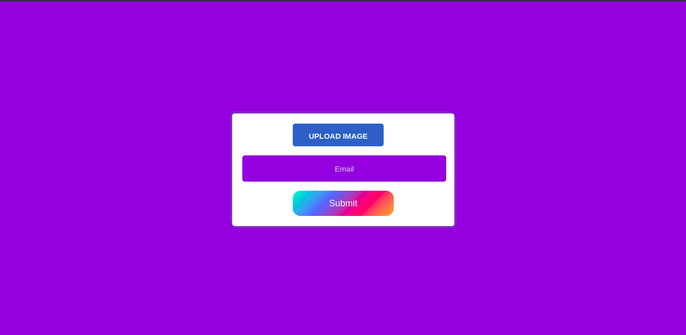
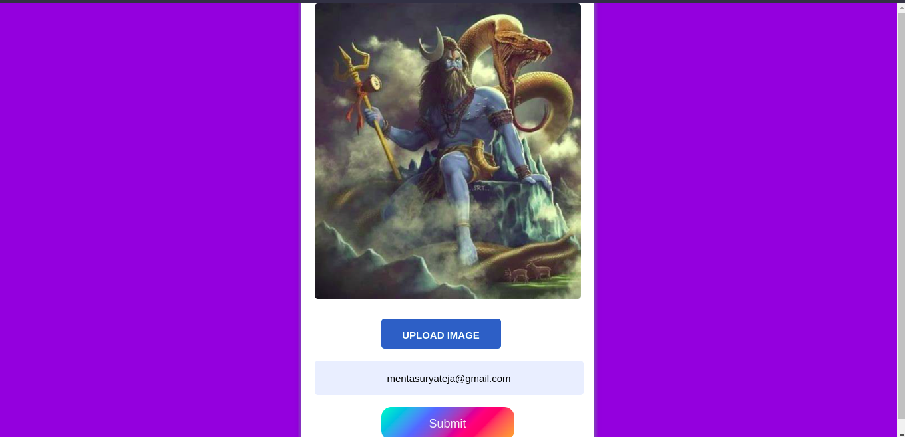
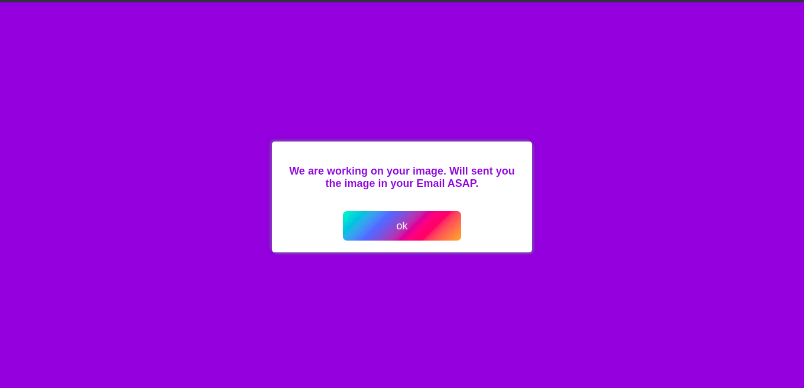
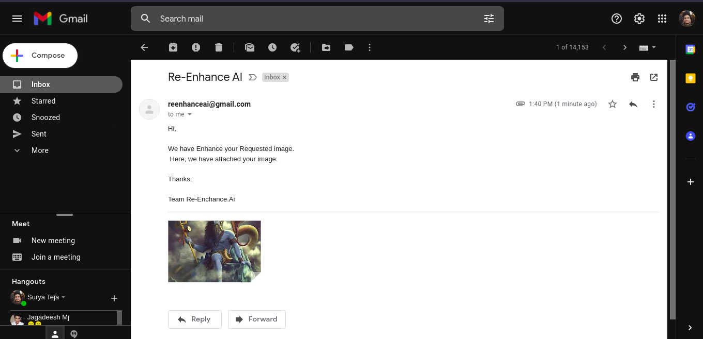

# Re-Enhance.AI

The Re-Enhance.AI project is a set of tools and algorithms that can be used to improve the quality of your Image.

The tools are designed to be used in a concurrent multi-threaded environment.we can run this web app with one or more images. The Resultant Super Resolution image is mailed to the user. After the task done, the depending folders are deleted.


### Installation

1. Clone repo

    ```bash
    git clone https://github.com/Surya-Teja-Menta/Re-Enhance.AI.git
    cd Real-ESRGAN
    ```

2. Install dependent packages
    ```bash
    #if you have GPU
    pip install torch torchvision
    pip install -r requirements.txt
    ```
    ```bash
    #if you don't have GPU
    pip3 install torch torchvision torchaudio --extra-index-url https://download.pytorch.org/whl/cpu
    pip install -r requirements.txt
    ```
3. Run the code

    ```bash
    python application.py
    ```

## Usage
---
1. Go to the link/localhost.<br>
<center></center>

2. Select the image you want to enhance and enter your mail.<br>
<center></center>

3. Click on the button "Submit". You will get the prompt that we are working (Its really working in backend).<br>
<center></center>

4. You will get the image with the enhanced quality via mail.<br>
<center></center>


## Outputs
---
Test Image | Enhanced Image 
:----------:|:-------------:
 |   

Observe the details in the Generated Enhanced Image. The enhanced image is a super resolution image.

|Properties |  Test Image | Enhanced Image
:----------:|:----------:|:-------------:
Resolution |  528x474x3 | 2112x1896x3
Size |  32KB | 732KB

The Enhanced Image is a super resolution image. it will be a lot better than the test image. it will sent to your mail via Re-Enhance.AI. We can send this image to the generater again and again, for every time we will get a better image than previous one.


### Note:
- Please enable Allow Less Secure Apps in your Gmail account which is used to send images. 
